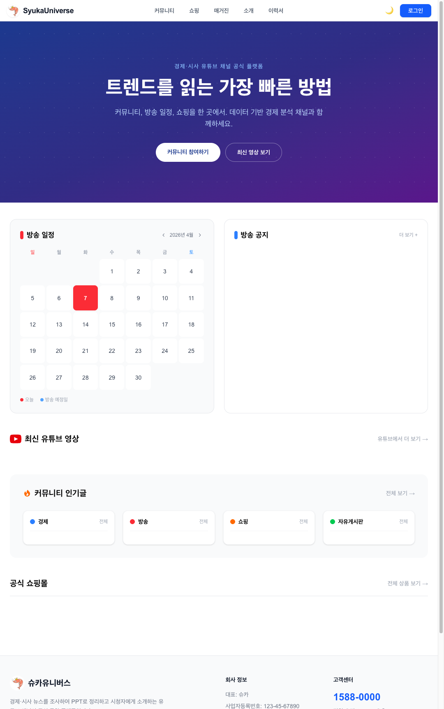
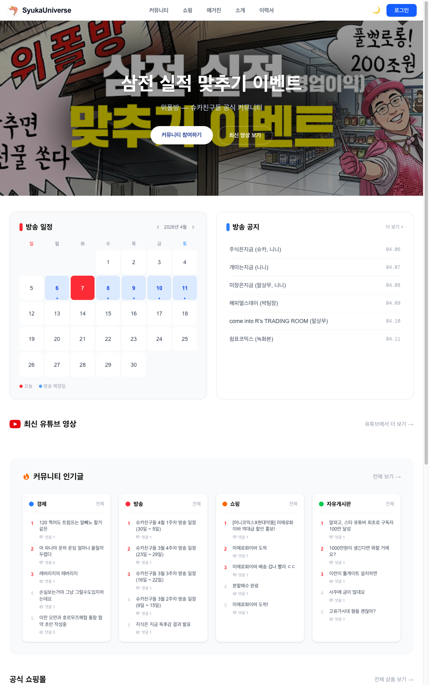
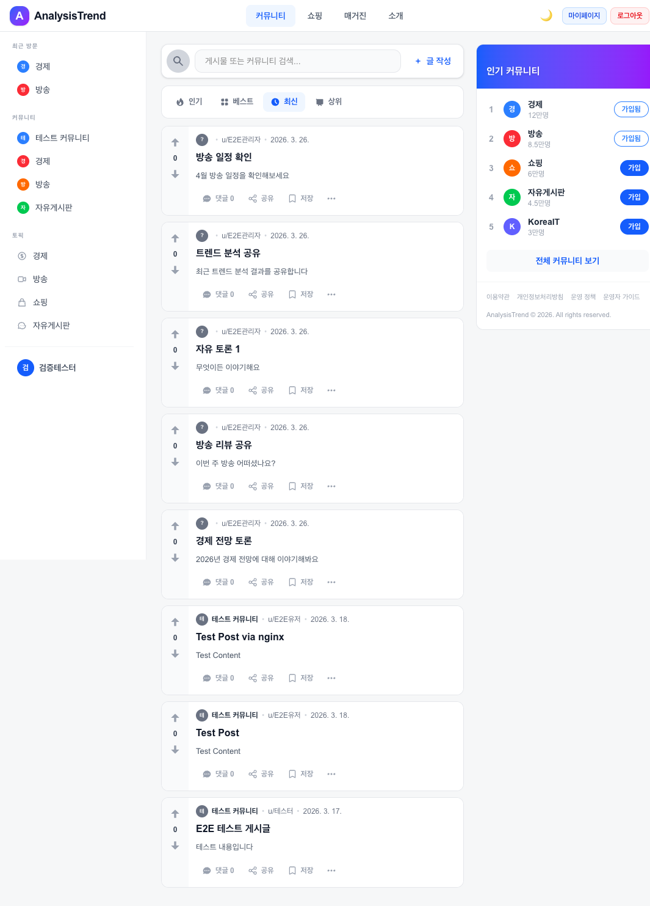
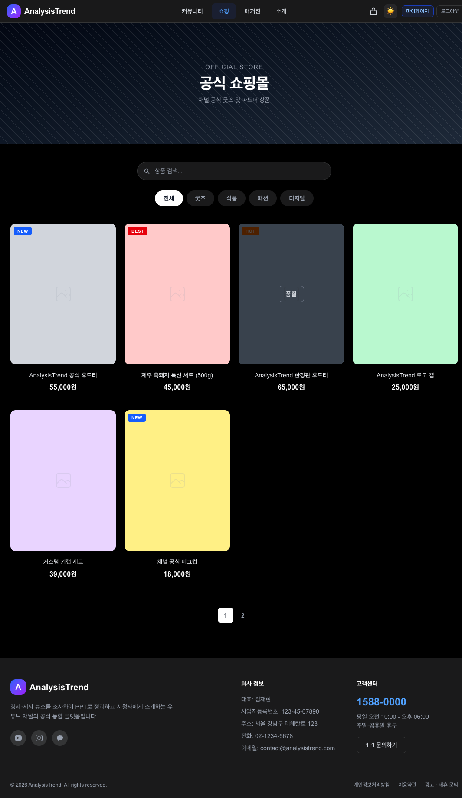

# analysisTrend

> 경제·시사 유튜브 채널 생태계를 위한 통합 플랫폼 —
> 시청자에게는 **커뮤니티·쇼핑**을, 운영팀에게는 **AI 기반 콘텐츠 인텔리전스**를 제공합니다.

**🌐 [syukauniverse.com](https://syukauniverse.com)** · API: `api.syukauniverse.com`


---

## 주요 화면

| 홈 — 방송일정·유튜브·커뮤니티 | 홈 — 배너·쇼핑 섹션 |
|---|---|
|  |  |

| 커뮤니티 — 카드형 게시판 | 공식 쇼핑몰 |
|---|---|
|  |  |

---

## 주요 기능 한눈에 보기

| 대상 | 기능 |
|---|---|
| **시청자** | 커뮤니티(게시글·댓글·투표) · 쇼핑몰(장바구니·Q&A·리뷰) · 소셜 로그인 · 다크모드 |
| **운영자** | 관리자 콘솔 CRUD · 채팅 분석(히트맵·피크 감지) · 트렌드 대시보드 · 회원 관리 |

---

## 서비스 구성

| 서비스 | 스택 | 역할 |
|---|---|---|
| `frontend/` | Next.js 16 · React 19 · TypeScript · Tailwind v4 · Zustand | FSD 아키텍처, SSR/ISR, 관리자 콘솔 |
| `backend/` | Spring Boot 3.5 · Java 17 · JPA · QueryDSL · Redis · JWT + OAuth2 | 도메인 API, 인증, `ApiResponse<T>` 표준 응답 |
| `analysis/` | FastAPI · Python · APScheduler · yt-dlp · Naver/YouTube API | 채팅 분석, 뉴스·유튜브 트렌드 수집 (30분 주기) |
| `e2e/` | Playwright | 6개 워크플로우 그룹 · 77개 시나리오 |
| `nginx/` | Nginx | 포트 80 단일 진입점, 리버스 프록시 |

---

## 아키텍처

```
   Cloudflare CDN / Vercel
           │
    ┌──────▼──────┐
    │   Next.js   │  SSR + ISR (홈 revalidate=60)
    │  (Frontend) │  FSD · Zustand persist
    └──────┬──────┘
           │
   ┌───────┴──────────┐
   │                  │
┌──▼──────────┐  ┌────▼────────┐
│ Spring Boot │  │   FastAPI   │
│  (Railway)  │  │  (Railway)  │
│ JWT, OAuth2 │  │  분석 서비스 │
└──┬──────────┘  └────┬────────┘
   │                  │
┌──▼──────┐  ┌────────▼─────────────┐
│  MySQL  │  │  Redis (캐시·세션)   │  외부 API (Naver, YouTube)
│(Railway)│  └──────────────────────┘
└─────────┘
```

---

## 성능 최적화

| 항목 | 내용 | 효과 |
|---|---|---|
| **홈화면 SSR 전환** | `page.tsx` → Server Component, 5개 API 병렬 fetch + ISR | 초기 로딩 **1.2s → 150ms** (8배 개선) |
| **Redis `@Cacheable`** | 공개 GET에 30분 캐시, Redis 장애 시 DB 폴백 | DB 부하 감소 |
| **CDN 캐시 활성화** | `CdnCacheFilter`로 `public, s-maxage=300` 헤더 주입 | Cloudflare 캐시 적중률 향상 |

---

## 기능 상세

### 시청자 기능

- **커뮤니티** — 게시글·댓글(재귀 트리)·투표·검색·가입, 모던 카드 UI
- **쇼핑몰** — 카테고리 필터, 다중 이미지 슬라이더, Q&A·리뷰, 장바구니(persist)
- **매거진** — 블록 에디터(텍스트·이미지 자유 혼합), 관리자 저장 → 즉시 반영
- **인증** — Google/Kakao/Naver OAuth2 + JWT 자동 재발급, 탭 닫으면 자동 로그아웃

### 운영자 기능

- **관리자 콘솔** — 배너·방송일정·유튜브·광고·매거진 CRUD, 품절 토글, 다중 이미지 업로드
- **채팅 분석** — live_chat.json 업로드 → 분당 버킷 집계 → `평균 + 1.5σ` 피크 감지 → 편집 하이라이트 자동 추출
- **트렌드 대시보드** — Naver News + YouTube Data API v3 30분 주기 수집, 일/주/월 필터
- **회원 관리** — 이메일 검색, 역할 기반 접근 제어(`ADMIN`)

---

## 테스트 전략

```
E2E (Playwright · 77개)       ← 실제 DB + 브라우저
  └── Group A~F (홈/관리자·커뮤니티·쇼핑·분석·UX·종합)

Integration (JUnit · H2)      ← Spring Boot 도메인 API

Unit (Jest + pytest · 65+)    ← Zustand 스토어 5개, analysis 서비스 48개
```

**현황**: 77 E2E / 74 passed / 3 skipped / 0 failed

---

## Claude Code 하네스 엔지니어링

이 프로젝트의 핵심 차별점 — **AI 코딩 에이전트를 단순 코드 생성기가 아닌, 재현 가능한 엔지니어링 환경으로 설계**했습니다.

### 1. 계층적 CLAUDE.md — 컨텍스트 엔지니어링

```
analysisTrend/
├── CLAUDE.md              ← 루트: 빠른 명령어, 인프라, 배포 개요
├── frontend/CLAUDE.md     ← FSD 구조, Zustand 스토어 매트릭스
├── backend/CLAUDE.md      ← 패키지 구조, 엔드포인트 테이블, Redis 이슈
├── analysis/CLAUDE.md     ← 피크 감지 알고리즘, mock 날짜 정책
└── e2e/CLAUDE.md          ← 워크플로우 그룹, 테스트 실행법
```

- 서비스별 컨텍스트 분리 → 토큰 낭비 없이 관련 지식만 활용
- **실패 사례 명문화** → "Turbopack 한글 경로 패닉", "Redis 직렬화 `@NoArgsConstructor` 필수" 등 반복 실수 방지
- 날짜 태그(`2026-04-07`)로 최근 결정 우선 반영

### 2. 7개 MCP 서버 — 실시간 인프라 제어

| MCP 서버 | 역할 |
|---|---|
| `mysql` | 로컬 DB 질의 (마이그레이션 검증, 데이터 분석) |
| `redis` | 캐시 진단 및 초기화 |
| `docker` | 컨테이너 빌드·제어 자동화 |
| `railway` | 프로덕션 환경변수·배포 로그 스트리밍 |
| `vercel` | 프론트엔드 배포 상태·런타임 로그 |
| `playwright` | 실제 브라우저 E2E 검증 |
| `context7` | Next.js 16, Spring Security 6 등 최신 문서 조회 |

> "코드를 쓰는 AI"가 아니라 **"배포·DB·캐시·브라우저까지 다루는 AI 오퍼레이터"** 환경을 구축.

### 3. Memory · Permission · Worktree

| 기법 | 목적 |
|---|---|
| **Memory System** | 대화가 끊겨도 아키텍처 판단 일관성 유지 (장기 기억 파일) |
| **Permission 설계** | read-only + 빌드 명령 사전 허용 → 50+ 커맨드 무중단 루프, 파괴적 작업은 수동 승인 |
| **Git Worktree** | 여러 Wave(기능 단위) 병렬 개발, 메인 브랜치 충돌 없이 회귀 테스트 |

---

## 로컬 실행

```bash
# 전체 스택 (Nginx:80, MySQL, Redis, Backend:8080, Frontend:3000, Analysis:8000)
docker-compose up -d

# DB만 (백엔드 로컬 개발 시)
docker-compose up -d mysql redis

# 프론트엔드 개발 서버
cd frontend && npm run dev

# 백엔드
cd backend && ./gradlew bootRun

# 분석 서비스
cd analysis && uvicorn main:app --reload --port 8000
```

> `npm run build`는 로컬에서 사용 금지 — Turbopack이 한글 경로에서 패닉합니다. 타입 검사는 `npx tsc --noEmit` 사용.

---

## 배포 현황

| 자원 | 플랫폼 | 주소 |
|---|---|---|
| Frontend | Vercel | `syukauniverse.com` |
| Backend | Railway | `api.syukauniverse.com` |
| MySQL | Railway | `ballast.proxy.rlwy.net:37097` |
| Redis | Railway | 내부 네트워크 |
| Analysis | Railway | `analysis-production-f8b2.up.railway.app` |

> AWS(EC2/RDS/ElastiCache/CloudFront/Route53) 이전 설계 완료 → [`claudedocs/infra_design_aws.md`](./claudedocs/infra_design_aws.md)

---

## 디렉터리 구조

```
analysisTrend/
├── frontend/            # Next.js 16 (FSD)
│   └── src/
│       ├── shared/      # api, types, mocks, Zustand, ui
│       ├── entities/    # 도메인 모델·UI (post, product …)
│       ├── features/    # 사용자 기능 (auth, search …)
│       ├── widgets/     # Header, Footer, Sidebar
│       └── app/         # App Router 페이지
├── backend/             # Spring Boot 3.5
│   └── src/main/java/backend/
│       ├── global/      # config, auth, ApiResponse
│       └── user/ community/ post/ product/ banner/ …
├── analysis/            # FastAPI
│   ├── routers/ services/ parsers/ models/ tasks/ tests/
├── e2e/                 # Playwright 테스트
├── nginx/               # 리버스 프록시
├── claudedocs/          # 워크플로우·트러블슈팅·인프라 설계 문서
├── CLAUDE.md            # AI 에이전트 가이드
└── docker-compose.yml
```

---

## 문서

| 문서 | 내용 |
|---|---|
| [`PRD.md`](./PRD.md) | Product Requirements Document |
| [`SPEC.md`](./SPEC.md) | 기능 스펙 |
| [`RULES.md`](./RULES.md) | 개발 규약 |
| [`CLAUDE.md`](./CLAUDE.md) | AI 에이전트 통합 가이드 |
| [`claudedocs/workflow_analysisTrend.md`](./claudedocs/workflow_analysisTrend.md) | 실행 규약 |
| [`claudedocs/infra_design_aws.md`](./claudedocs/infra_design_aws.md) | AWS 이전 설계 |

---

## 개발하며 배운 것

> **AI 에이전트 시대의 코드베이스는 "두 번 읽힌다"** — 한 번은 사람이, 한 번은 AI가.

- **CLAUDE.md는 문서가 아니라 API다** — 서비스별로 분리하고 실패 사례를 기록해야 토큰 효율이 산다
- **MCP는 에이전트의 손이다** — DB·Docker·배포 플랫폼을 제어하지 못하는 AI는 코드만 보는 비서에 그친다
- **Memory는 프로젝트의 해마다** — 대화는 휘발하지만, 의사결정 맥락은 휘발해선 안 된다
- **Permission·Worktree는 안전한 속도다** — 과도한 승인 요청은 흐름을 끊고, 무제한 권한은 위험하다

---

**Author**: hyun · jaehyoen3@gmail.com

> *"Claude Code는 도구가 아니라 협업 파트너다 — 그 파트너가 가장 잘 일하도록 환경을 설계하는 것, 그것이 하네스 엔지니어링이다."*
